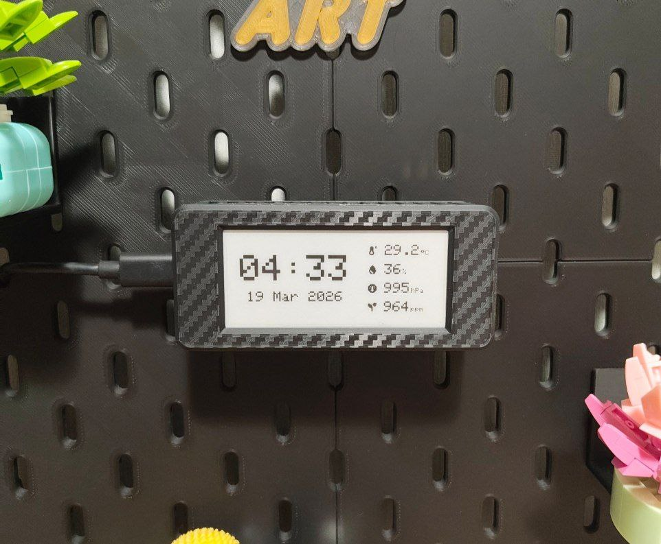
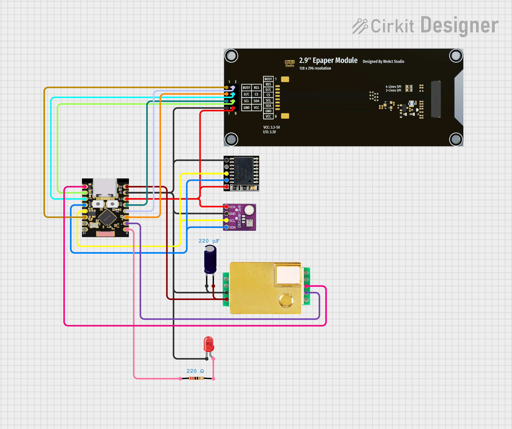

## 🖥️ ESP32-C3 E-Ink Environment Clock

**eink-environment-clock** is a minimal ESP32-C3 based E-Ink desk clock that displays time and indoor air data.
It combines a low-power E-Ink screen with CO₂, temperature, humidity, and pressure sensing, making it useful as both a clock and a compact environment monitor.



## 🧩 PCB

PCB design and assembly are illustrated with the following reference images:

```bash
images/
├── assembled_board_image.png   # photo of the assembled and soldered board
├── circuit_image.png           # circuit overview
├── pcb_back_image.png          # PCB back side
├── pcb_front_image.png         # PCB front side
└── schematic_image.png         # schematic diagram
```

### Circuit



## 💾 Sketch

The firmware for this project is located in:

```bash
sketch/
└── eink-environment-clock.ino
```

## 📚 Libraries

This project uses the following Arduino libraries:

* **GxEPD2** — by Jean-Marc Zingg
* **Adafruit GFX Library** — by Adafruit
* **Adafruit BME280 Library** — by Adafruit
* **RTClib** — by Adafruit
* **MHZ19** — by WifWaf

## 📦 Case

The case model for this project is located in:

```bash
3d_model/
├── stp
│   ├── backplate.stp
│   ├── center.stp
│   └── frontplate.stp
├── case.3mf
└── case.m3d
```

## ⚠️ Known Issues

* Holes for the **MH-Z19** are too small.
* There are several issues with the mounting holes in general. Some modules are placed too close to the mounting holes, which sometimes makes assembly and fastening inconvenient.
* The wrong header type was selected for external modules such as the display. The headers I used turned out to be smaller than the ones I had, so I ended up soldering the connection cable directly.
* Poor implementation of the case design

## 📜 License

This project is licensed under the MIT License. See the [LICENSE](./LICENSE) file for details.
