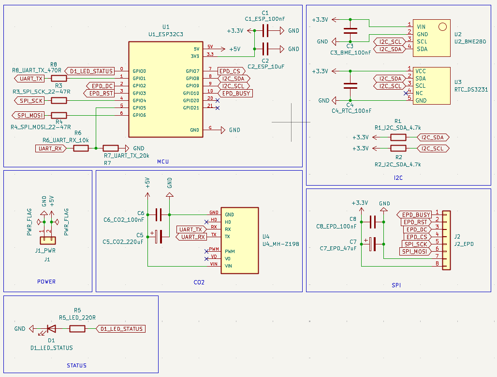
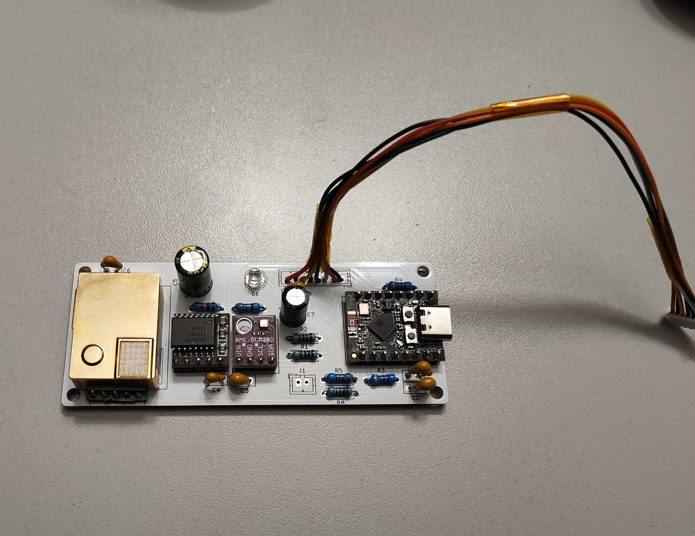

## 🖥️ ESP32-C3 E-Ink Environment Clock

**eink-environment-clock** is a minimal ESP32-C3 based E-Ink desk clock that displays time and indoor air data.
It combines a low-power E-Ink screen with CO₂, temperature, humidity, and pressure sensing, making it useful as both a clock and a compact environment monitor.

## 🧩 PCB

### Circuit

### Schematic

### Assembled PCB

## ⚠️ Known Issues

* Holes for the **MH-Z19** are too small.
* There are several issues with the mounting holes in general. Some modules are placed too close to the mounting holes, which sometimes makes assembly and fastening inconvenient.
* The wrong header type was selected for external modules such as the display. The headers I used turned out to be smaller than the ones I had, so I ended up soldering the connection cable directly.

## 📜 License

This project is licensed under the MIT License. See the [LICENSE](./LICENSE) file for details.
